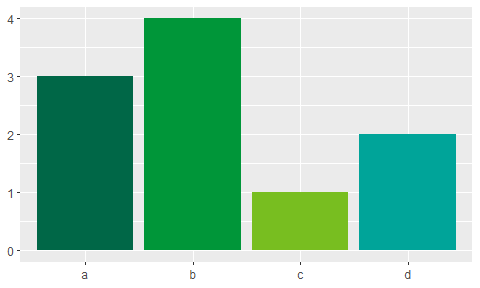

<!-- README.md is generated from README.Rmd. Please edit that file -->

# NHS-R Theme <a alt="NHS-R Community's logo" href="https://nhsrcommunity.com/"></a><a alt="NHSRtheme logo" href="https://nhs-r-community.github.io/NHSRtheme/"></a>

<!-- badges: start -->

[](https://github.com/nhs-r-community/NHSRtheme/actions)
[](https://github.com/nhs-r-community/NHSRtheme/actions/workflows/R-CMD-check.yaml)
<!-- badges: end -->

This repo attempts to build an R package that can provide themes to
ggplot for producing charts that follow the [NHS
Identity](https://www.england.nhs.uk/nhsidentity/).

This package will also produce xaringan presentation slides that can be
viewed as HTML. For more details please see the vignette provided.

# Installing NHSRtheme

`{NHSRtheme}` is not currently on CRAN, so you will have to install it
directly from Github using devtools.

If you do not have the devtools package installed, you will have to run
the first line in the code below as well.

``` r
# install.packages('devtools')
devtools::install_github('nhs-r-community/NHSRtheme')
```

## Examples

``` r
library(ggplot2)
library(NHSRtheme)
df <- data.frame(x = c("a", "b", "c", "d"), y = c(3, 4, 1, 2))
bars <- ggplot(df, aes(x, y, fill = x)) + 
    geom_bar(stat = "identity") + 
    labs(x = NULL, y = NULL) +
    theme(legend.position = "none")
```

``` r
bars + scale_fill_nhs()
```

<!-- -->

``` r
bars + scale_fill_nhs(palette = 'blues')
```

<!-- -->

``` r
bars + scale_fill_nhs(palette = 'neutrals') 
```

<!-- -->

``` r
bars + scale_fill_nhs(palette = 'support greens')
```

<!-- -->

``` r
df2 <- data.frame(x = c("a", "b", "c", "d", "e", "f" ,"g", "h"), 
                  y = c(3, 4, 1, 2, 5, 9, 7, 4))

bars2 <- ggplot(df2, aes(x, y, fill = x)) + 
    geom_bar(stat = "identity") + 
    labs(x = NULL, y = NULL) +
    theme(legend.position = "none")

bars2 + scale_fill_nhs(palette = 'highlights')
```

<!-- -->
